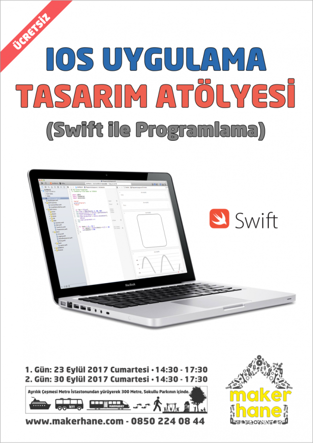

# iOS Uygulama Tasarım Atölyesi - Sketch4XCode

!!! Slack grubundan Skettc4XCode (sketch4xcode.slack.com) her türlü sorunuzu iletebilirsiniz. 



iOS Tasarım Atölyesi boyunca kullanılacak tüm içerik burada yer almaktadır. 
İleriye dönük olarak sunum dosyaları ve uygulama örnekleri eklenecektir. Üzerinde çalışma yapacaksanız lütfen repo'yu fork ediniz. Yararlı olabilecek link'ler "Kaynaklar" dosyasındadır.

## Eklenecek Uygulama Örnekleri

- [x] TableView Temelleri (Uygulamalar 1.1 - 1.4)
- [x] TableView Header + Section (Uygulamalar 1.5 - 1.6)
- [x] Parallax Scrolling TableView Eklendi (1.Bonus)
- [x] Segue'ler Arasında Data Gönderme Eklendi (Uygulamalar 1.7)
- [x] JSON Dosyasını Parse Etme Eklendi (Uygulamalar 1.8)
- [x] JSON Dosyasından Tablolaya Data Yazma Eklendi (Uygulamalar 1.9)
- [x] TableView CoreData Örneği Eklendi (Uygulamalar 1.10)
- [x] API'den JSON Parse Etme, CollectionView'da Gösterme Eklendi(Uygulamalar 2.1)
- [ ] CollectionView Temelleri  --> Eklenecek
- [ ] CollectionView + TableView --> Eklenecek

## Kullanım

1) Repository'yi indirin

```
$ git clone https://github.com/ssaylanc/Sketch4XCode.git
$ cd Sketch4XCode/Uygulamalar
```

2) İlgili uygulama klasörüne girin ve Podfile dosyası görüyorsanız, podları yükleyin

```
$ pod install
```

3) Podlar yüklenmedi ise

```
$ open ornek.xcodeproj
```

4) Podlar yüklendi ise

```
$ open ornek.xcworkspace
```

# Requirements
- XCode 9.0
- Swift 4
- ios 11


# Teşekkürler
- [Makerhane](http://www.makerhane.com) ekibine yardımları için teşekkür ederiz.


